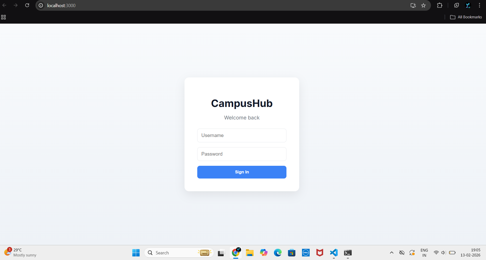
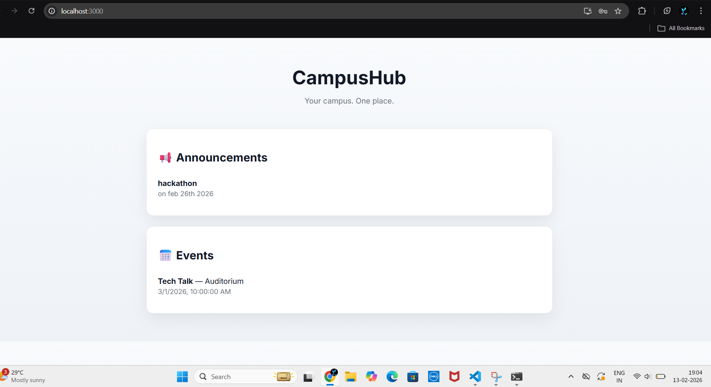

# 🎓 CampusHub

CampusHub is a full-stack campus communication platform that centralizes announcements and events into a single portal.

It solves the problem of fragmented communication across emails, WhatsApp groups, and notice boards.


## Features

- Role-based login (Admin / Student)
- Admin can create announcements
- Events listing
- React frontend
- Spring Boot REST API backend
- MySQL database integration


## Tech Stack

Frontend:
- React
- CSS

Backend:
- Spring Boot
- Spring Data JPA
- REST APIs

Database:
- MySQL


##Architecture

React (Port 3000)
    ↓ fetch
Spring Boot API (Port 8082)
    ↓ JPA
MySQL Database


## How to Run

### Backend

```bash
cd campushub
mvn spring-boot:run

### runs on
http://localhost:8082

### FRONTEND
cd campushub-frontend
npm install
npm start

###runs on
http://localhost:3000

### DEMO login
Admin: 
username: admin
password: anything

user:
username: anything else
password: anything

## 📷 Screenshots

### Login Page


### Dashboard

